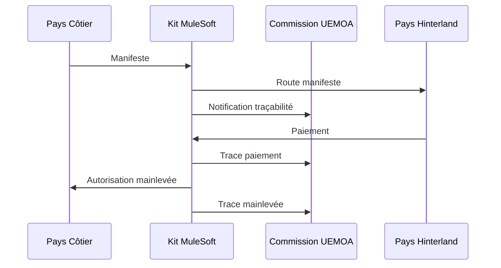

# 🏛️ Simulateur Commission UEMOA - Traçabilité

Simulateur de la Commission UEMOA pour le système de traçabilité des opérations d'interconnexion des systèmes informatiques douaniers.

## 🎯 Objectif

Ce simulateur représente le système central de la Commission UEMOA qui :
- **Collecte** toutes les opérations d'échange entre pays membres
- **Trace** les flux de données pour audit et analyse  
- **Fournit** des statistiques en temps réel
- **Monitore** l'activité des corridors commerciaux

## 🏗️ Architecture

```
Commission UEMOA Simulator
├── 📡 APIs de Traçabilité
│   ├── /api/health - Statut du service
│   ├── /api/tracabilite/enregistrer - Enregistrement opérations
│   └── /api/statistiques - Métriques globales
├── 💾 Base de Données In-Memory
│   ├── Opérations tracées
│   ├── Statistiques par pays
│   └── Métriques temps réel
└── 📊 Dashboard Web
    ├── Visualisation statistiques
    ├── Monitoring corridors
    └── Export données
```

## 🚀 Déploiement

### Option 1: Vercel (Recommandé - Cloud)
```bash
# 1. Installer Vercel CLI
npm i -g vercel

# 2. Déployer
vercel --prod

# 3. Le service sera accessible sur:
# https://commission-uemoa-[hash].vercel.app
```

### Option 2: Local
```bash
# 1. Installer dépendances
npm install

# 2. Démarrer en mode développement
npm run dev

# 3. Accéder au dashboard
open http://localhost:3000
```

### Option 3: Docker
```bash
# 1. Build image
docker build -t commission-uemoa .

# 2. Run container
docker run -p 8083:3000 commission-uemoa

# 3. Accès
open http://localhost:8083
```

## 📋 APIs Disponibles

### 🏥 Health Check
```bash
GET /api/health

Response:
{
  "service": "Commission UEMOA - Traçabilité",
  "status": "UP",
  "version": "1.0.0-POC",
  "timestamp": "2025-01-15T10:00:00Z"
}
```

### 📊 Enregistrement Opération
```bash
POST /api/tracabilite/enregistrer

Body:
{
  "typeOperation": "TRANSMISSION_MANIFESTE",
  "numeroOperation": "MAN2025001-20250115103000",
  "paysOrigine": "CIV",
  "paysDestination": "BFA",
  "donneesMetier": {
    "numeroManifeste": "MAN2025001",
    "transporteur": "MAERSK LINE",
    "nombreMarchandises": 2,
    "valeurTotaleEstimee": 400000
  }
}

Response:
{
  "status": "RECORDED",
  "message": "Opération enregistrée avec succès",
  "numeroOperation": "MAN2025001-20250115103000",
  "id": "OP1642253400123"
}
```

### 📈 Statistiques
```bash
GET /api/statistiques

Response:
{
  "global": {
    "operationsTotal": 42,
    "operationsAujourdhui": 15,
    "paysActifs": ["CIV", "BFA", "MLI"],
    "derniereMiseAJour": "2025-01-15T14:30:00Z"
  },
  "parPays": [
    {
      "code": "CIV",
      "operationsEnvoyees": 12,
      "operationsRecues": 8,
      "dernierActivite": "2025-01-15T14:25:00Z"
    }
  ],
  "corridors": [
    ["CIV → BFA", 8],
    ["SEN → MLI", 6],
    ["BEN → NER", 4]
  ]
}
```

## 🧪 Tests et Validation

### Test Santé Service
```bash
curl https://commission-uemoa.vercel.app/api/health
```

### Test Enregistrement
```bash
curl -X POST https://commission-uemoa.vercel.app/api/tracabilite/enregistrer \
  -H "Content-Type: application/json" \
  -d '{
    "typeOperation": "TEST_CONNEXION",
    "paysOrigine": "TEST",
    "paysDestination": "TEST",
    "donneesMetier": {"test": true}
  }'
```

### Consultation Dashboard
Ouvrir: https://commission-uemoa.vercel.app

## 📊 Fonctionnalités Dashboard

### Métriques Temps Réel
- **Opérations totales** - Nombre cumulé d'échanges
- **Activité du jour** - Opérations aujourd'hui  
- **Pays actifs** - Nombre de pays ayant échangé
- **Corridors** - Routes commerciales utilisées

### Visualisations
- **Graphique par type** - Répartition des opérations
- **Activité par pays** - Volume par État membre
- **Corridors actifs** - Top 10 des routes
- **Journal temps réel** - Dernières opérations

### Fonctions Administratives
- **Export données** - Téléchargement JSON/CSV
- **Simulation test** - Génération opérations fictives
- **Remise à zéro** - Nettoyage données

## 🔄 Intégration avec Kit MuleSoft

Le simulateur reçoit automatiquement les notifications du Kit d'Interconnexion :



## 🎛️ Configuration Environnement

### Variables Vercel
```bash
# Pas de variables requises - fonctionne out-of-the-box
```

### Variables Locales (.env)
```bash
PORT=3000
NODE_ENV=development
CORS_ORIGIN=*
```

## 🔧 Dépannage

### Problème: Dashboard vide
```bash
# Vérifier APIs
curl https://[votre-url]/api/health
curl https://[votre-url]/api/statistiques

# Solution: Enregistrer opération test
curl -X POST https://[votre-url]/api/tracabilite/enregistrer \
  -H "Content-Type: application/json" \
  -d '{"typeOperation":"TEST","paysOrigine":"TEST"}'
```

### Problème: CORS
```bash
# Headers ajoutés automatiquement dans chaque API
Access-Control-Allow-Origin: *
Access-Control-Allow-Methods: GET, POST, OPTIONS
```

### Problème: Déploiement Vercel
```bash
# Vérifier structure
vercel --debug

# Logs temps réel
vercel logs [deployment-url]
```

## 📞 Support POC

- **Dashboard Demo**: https://commission-uemoa.vercel.app
- **API Base**: https://commission-uemoa.vercel.app/api
- **Documentation**: Ce README
- **Issues**: Créer ticket GitHub

## 🏆 Statut POC

- ✅ **APIs fonctionnelles** - Traçabilité et statistiques
- ✅ **Dashboard interactif** - Visualisation temps réel
- ✅ **Déploiement cloud** - Haute disponibilité Vercel
- ✅ **Intégration Kit** - Compatible MuleSoft
- ✅ **Tests validés** - Scénarios bout-en-bout

---

*Simulateur Commission UEMOA v1.0.0 - POC Interconnexion Systèmes Douaniers UEMOA*